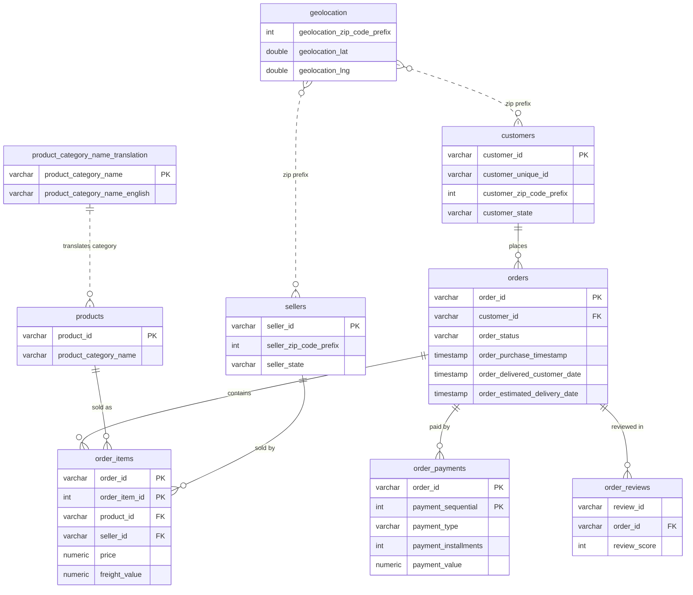

# Olist E-commerce SQL Analysis


End-to-end SQL analysis of the Olist Brazilian marketplace: about 99k orders from Sep 2016 to Aug 2018. Python loads the raw CSVs into PostgreSQL, SQL views clean the data, ten SQL files answer ten business questions, and the results are exported to CSV, charted and written up.

**One-line story:** slow delivery drives bad reviews, customers rarely come back (3.04% repeat), and revenue is concentrated in a few states and categories.

## The problem

An online marketplace wants to know where its revenue comes from, where delivery is failing, and whether customers return. The ten questions:

1. Monthly revenue trend
2. Top product categories
3. Late deliveries by category and state
4. Delivery time vs review score
5. Repeat customers and cohort retention
6. Customer segments (RFM)
7. Seller performance
8. Payment methods and instalments
9. Freight cost vs price
10. Geographic concentration of revenue

## Data source

[Brazilian E-Commerce Public Dataset by Olist](https://www.kaggle.com/datasets/olistbr/brazilian-ecommerce) on Kaggle (9 CSV files, anonymised real orders). Download it and put the nine CSVs in `data/raw/`. The data is not committed (`data/` is gitignored).

## How to run

Requirements: Python 3.12, Docker Desktop, and the nine CSVs in `data/raw/`.

```bash
cp .env.example .env              # Windows: copy .env.example .env
pip install -r requirements.txt
docker compose up -d --wait db
python -m src.pipeline            # load -> audit -> views -> 10 queries -> 5 charts
```

Windows without `make`: `.\run.ps1 setup` then `.\run.ps1 run`. With `make`: `make setup` then `make run`.

Run everything inside Docker instead:

```bash
docker compose --profile pipeline run --rm app
```

Other tasks: `test`, `lint`, `down` (for example `.\run.ps1 test` or `make test`).

Outputs: 20 CSVs in `outputs/`, 5 charts in `docs/images/`, a data-quality report in `docs/`.
Timed on a fresh clone (Windows, Docker Desktop, CSVs already downloaded, Postgres image already pulled): `pip install`, database start and the full pipeline took 3 min 50 s.

## Data model



Dotted lines are relationships with no foreign key in the database (zip prefix and category name joins). Only the key columns are shown.

## How it works

1. **Load** (`src/load_data.py`): explicit schema, bulk load with Postgres `COPY`, row counts verified, foreign keys and indexes added after the load. Safe to re-run.
2. **Audit** (`sql/00_quality_checks.sql`): duplicates, nulls, impossible dates, orphan keys. See `docs/data_quality_report.md` and the decisions in `docs/data_quality_findings.md`.
3. **Clean** (`sql/01_clean_views.sql`): 7 views, raw tables are never changed. `v_sales` is the main fact view.
4. **Analyse** (`sql/q01` to `q10`): CTEs and window functions, each file with a Question / Approach / Assumptions block.
5. **Chart** (`src/charts.py`): 5 PNGs built from the exported CSVs.

Key definitions: revenue = `SUM(price)` excluding freight, for orders that are not canceled or unavailable; a person = `customer_unique_id`; late = delivered after the estimated date; groups under 30 orders are flagged as low-sample and not ranked.

## Results

Total revenue: R$13,494,400.74. Full write-up with actions and caveats: [docs/findings.md](docs/findings.md).

- **Late delivery is the clearest problem.** Bad reviews (score 1-2) are 7.45% of orders delivered in under a week and 38.19% of orders that took 3+ weeks. Correlation between delivery days and review score: -0.334.
- **Customers rarely come back.** 3.04% buy again; month-1 retention is below 1% in every cohort.
- **Revenue is concentrated.** SP customers bring 38.27% of revenue, SP sellers 64.38%, and the top 10 categories 62.37%.
- **Lapsed high spenders are a win-back pool.** 14,012 customers hold R$3.9M (28.87% of revenue) and have not bought for about 400 days.

| | |
|---|---|
|  |  |
|  |  |
|  | |

## Tests and CI

89 tests with `pytest`: unit tests for the loader and helpers, integration tests on tiny hand-made data in a separate `olist_test` database (every expected number worked out by hand), static checks on the SQL files, and read-only checks on the real data that pin the revenue total. GitHub Actions runs `ruff` and `pytest` on a fresh PostgreSQL 16 container on every push.

## Limitations

- Correlation is not causation: slow delivery is associated with bad reviews, but stock-outs or product quality could drive both.
- Timestamps have no timezone; they are assumed to be Brazil local time.
- One dataset snapshot. The first and last months are partial, so the last full month is Aug 2018.
- RFM segment rules and the equal-weight seller score are judgement calls.
- 9 orders have a payment value of 0; they are kept on the unverified assumption that a voucher paid for them.
- The Nov 2017 revenue spike is probably seasonal, but this was not tested.

## Next steps

- DuckDB fallback so the analysis runs without Docker or PostgreSQL.
- Test the repeat-rate query on hand-made data.
- Test whether the Nov 2017 spike is seasonal (needs a second year of data).

## Project layout

```
configs/   settings (paths, seed, thresholds)
docs/      findings, data-quality report, charts
sql/       schema, constraints, audit, cleaning views, q01-q10
src/       loader, audit, views, query runner, charts, pipeline, healthcheck
tests/     unit, integration, static and full-data tests, mini fixtures
```