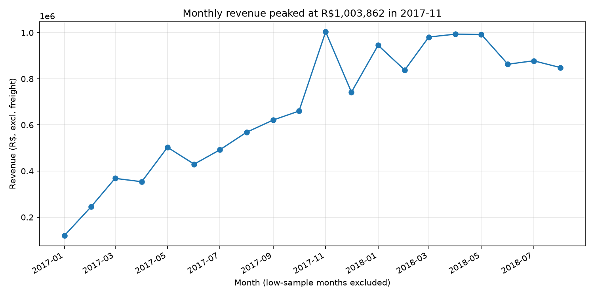
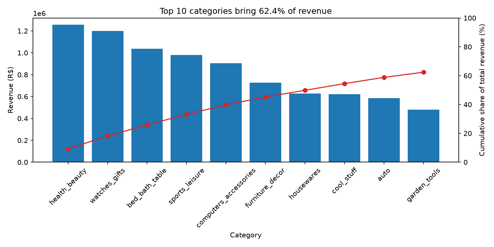
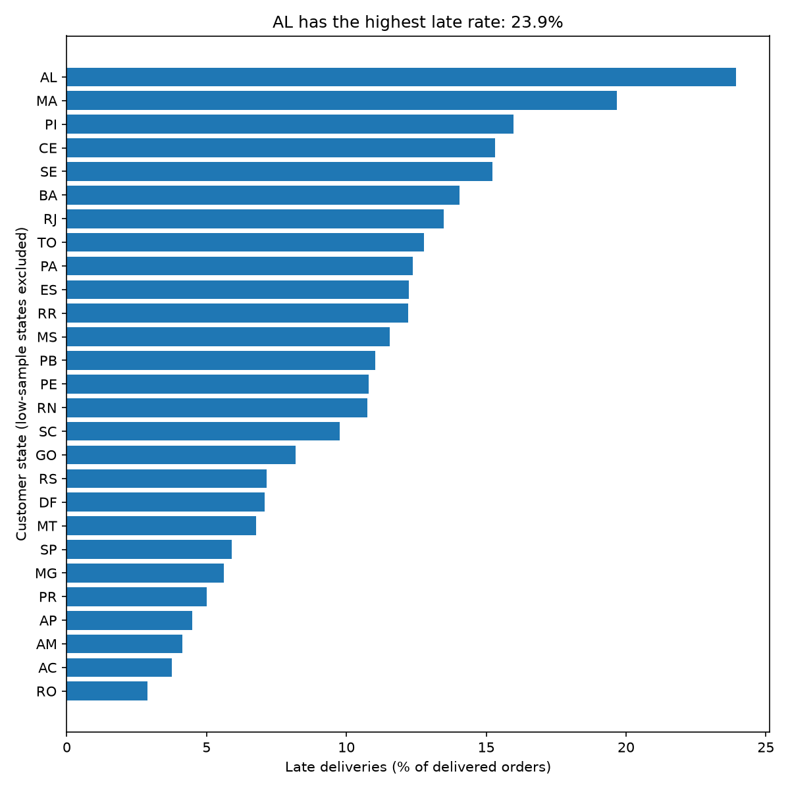
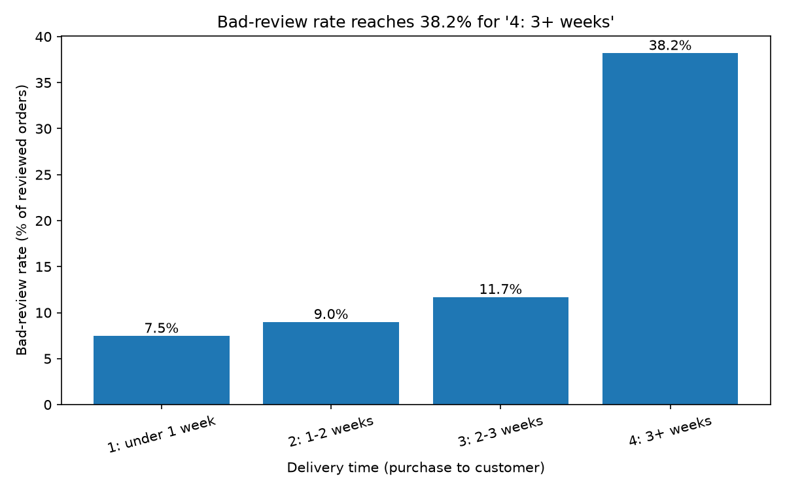
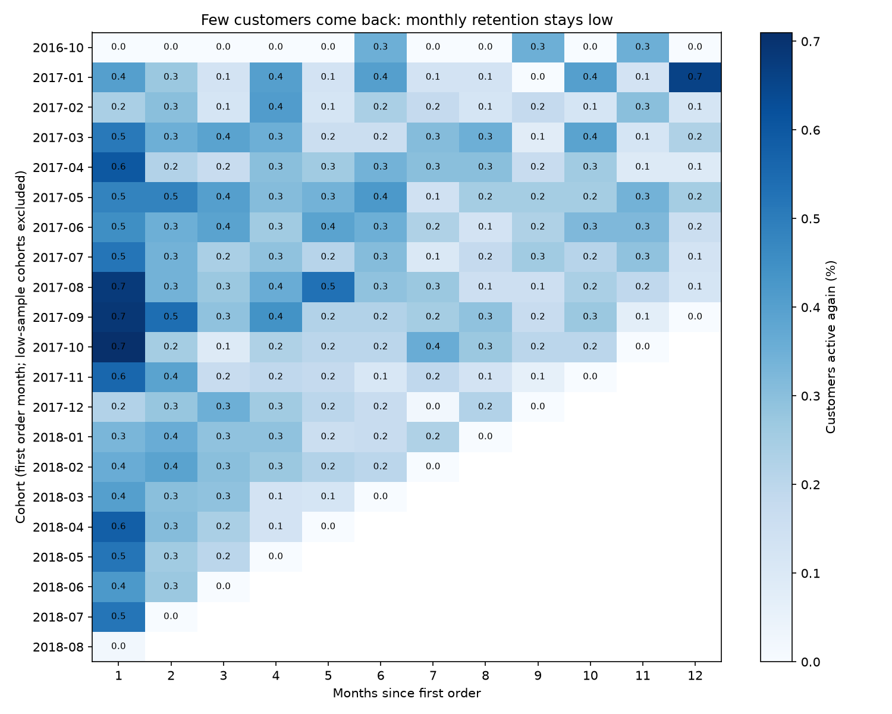

# Findings: Olist E-commerce SQL Analysis

Scope: about 99k orders, Sep 2016 to Aug 2018. Revenue is SUM(price) excluding freight, for non-canceled and non-unavailable orders. Total: R$13,494,400.74. Groups with fewer than 30 orders are flagged as low-sample and never ranked. Timestamps are naive and assumed to be Brazil local time.

## Top findings

1. **Late delivery is the clearest problem.** Bad reviews (score 1-2) are 7.45% of orders delivered in under 1 week and 38.19% for 3+ weeks. Delivery days and review score have a correlation of -0.334.
2. **Customers rarely come back.** Only 3.04% buy again, and month-1 retention is below 1% in every cohort.
3. **Revenue is concentrated.** SP customers bring 38.27% of revenue, SP sellers 64.38%, and the top 10 categories 62.37%.
4. **Lapsed high spenders are a big win-back pool.** 14,012 customers (14.75%) hold R$3.9M, or 28.87% of revenue, and have not bought for about 400 days.

## Q1. Monthly revenue
- **Insight:** Growth came from order volume, not bigger baskets. Orders went from 787 (Jan 2017) to 7,187 (Jan 2018), while average order value stayed in a R$125 to R$153 band. Revenue peaked at R$1,003,862 in Nov 2017, then settled at about R$850k to R$990k a month in 2018.
- **Action:** Plan stock and delivery capacity for the November peak. Look at why growth flattened in 2018.
- **Caveats:** 2016-09, 2016-11, 2016-12 and 2018-09 are low-sample, so their MoM % are not meaningful. The Nov 2017 spike is probably seasonal, but the cause was not tested. The chart starts at 2017-01.
- SQL: [q01](../sql/q01_monthly_revenue.sql) | Chart: 

## Q2. Top categories
- **Insight:** Top 3 are health_beauty (9.31%), watches_gifts (8.88%) and bed_bath_table (7.68%). The top 10 make up 62.37% of revenue. bed_bath_table has the most orders (9,399) but ranks third on revenue, while watches_gifts has far fewer orders (5,604) and nearly the same revenue.
- **Action:** Protect stock and delivery quality in the top 10. Treat watches_gifts as a high-value niche.
- **Caveats:** One product category per item, English names from the translation table (Portuguese fallback).
- SQL: [q02](../sql/q02_top_categories.sql) | Chart: 

## Q3. Late deliveries
- **Insight:** Late = delivered after the estimated date. AL has the worst late rate (23.93% of 397 orders), then MA (19.67%) and PI (15.97%). RJ is 13.47% on 12,350 orders, so it hurts the most customers. Among categories, bed_bath_table has the most orders that are both late and badly reviewed (442, 10.65% of all such orders). Across the top 7 categories, bad-review rate is 50.00% to 56.80% when late, versus 7.50% to 12.28% when on time.
- **Action:** Review carriers and estimated dates for AL, MA, PI and RJ. Start with bed_bath_table and health_beauty.
- **Caveats:** Undelivered orders are excluded from the late rate. furniture_mattress_and_upholstery tops the category list at 13.51% but has only 37 orders, so do not over-read it. The cause of late deliveries is not in this data.
- SQL: [q03](../sql/q03_late_delivery.sql) | Chart: 

## Q4. Delivery time vs reviews
- **Insight:** Average review score is 4.42 for under 1 week and 3.12 for 3+ weeks. The bad-review rate is 7.45%, 8.96%, 11.68%, then jumps to 38.19% at 3+ weeks (12,318 orders). Score-1 orders took 21.32 days on average and 37.86% were late. Score-5 orders took 10.68 days and 3.00% were late.
- **Action:** Treat 3 weeks as the point where service breaks down. Alert on orders approaching it.
- **Caveats:** Correlation is -0.334 on 95,824 orders. It shows association, not causation. Product quality or stock-outs could drive both slow delivery and bad reviews.
- SQL: [q04](../sql/q04_delivery_vs_review.sql) | Chart: 

## Q5. Retention
- **Insight:** 2,887 of 94,983 customers (3.04%) ordered more than once. The most orders by one customer is 16. For cohorts from 2017-01 to 2018-07, month-1 retention is between 0.22% and 0.71%.
- **Action:** Retention is a weak spot, so test a post-purchase email or voucher offer and measure it.
- **Caveats:** People are counted by `customer_unique_id`. The 2018-08 cohort shows 0.02% in month 1 because the data ends around then, so it is not real. The 2016-10 cohort shows 0.0%.
- SQL: [q05](../sql/q05_retention.sql) | Chart: 

## Q6. RFM segments
- **Insight:** Champions are small: 1,236 customers (1.3%) and 2.47% of revenue. Recent high spenders (15.5% of customers) bring 29.25% of revenue. Lapsed high spenders (14.75% of customers, last purchase about 400 days ago) hold 28.87%, or R$3,895,443. In total, high spenders (recent and lapsed) are 30.25% of customers and 58.12% of revenue.
- **Action:** Run a win-back campaign for lapsed high spenders. Nudge recent high spenders (average 1.0 orders) toward a second purchase.
- **Caveats:** Recency is measured from the last date in the data. Segment rules (NTILE(5) for recency and spend, fixed rules for frequency) are my judgement calls, not a standard.
- SQL: [q06](../sql/q06_rfm_segmentation.sql)

## Q7. Seller performance
- **Insight:** Only 634 sellers have 30+ orders, and they make 77.07% of revenue (R$10.40M). The other 2,419 sellers (22.93%) are too small to rank fairly. The top-ranked sellers have late rates of 0% to 2.6% and review scores of 4.31 to 4.58. Their revenue ranks range from 31 to 112 of the 634, so the ranking rewards reliability, not size.
- **Action:** Use the ranking to set up a seller quality programme. Review sellers at the bottom of the list.
- **Caveats:** Overall rank is the equal-weight average of revenue rank, late-rate rank and review rank, which is an assumption. Seller IDs are anonymised in the data.
- SQL: [q07](../sql/q07_seller_performance.sql)

## Q8. Payments
- **Insight:** Credit card is used in 77.0% of orders and 78.47% of payment value. Boleto is 19.9% and 17.96%. Voucher is 3.81% and 2.22%. Debit card is 1.54% and 1.35%. Average order value rises with instalments: R$96.08 for 1 instalment (25,027 orders) and R$413.28 for 10 (5,233 orders). Correlation is 0.377 on 75,616 orders.
- **Action:** Keep instalment options on credit card, since they go with bigger baskets. Check whether boleto orders have more drop-off at payment.
- **Caveats:** Order shares add up to more than 100% because an order can use several payment types. Payment value includes freight. Shoppers probably pick instalments because the order is expensive, so this is not proof that instalments raise spending. Instalment groups with fewer than 30 orders are flagged.
- SQL: [q08](../sql/q08_payments.sql)

## Q9. Freight
- **Insight:** Freight is 22.74% of item price in the North and 21.74% in the Northeast, against 15.16% in the Southeast. Average freight per item is R$36.85 in the North and R$17.37 in the Southeast. By category, furniture_mattress_and_upholstery is the highest at 37.33%, followed by christmas_supplies (36.66%). electronics is high (29.5%) and large (2,543 orders).
- **Action:** Look at shipping fee thresholds or regional carriers for the North and Northeast.
- **Caveats:** The ratio is SUM(freight) / SUM(price), a weighted ratio. Distance and weight are not controlled for.
- SQL: [q09](../sql/q09_freight.sql)

## Q10. Geographic concentration
- **Insight:** SP customers bring 38.27% of revenue and the top 7 states reach 81.47%. Sellers are more concentrated: SP has 1,822 sellers and 64.38% of revenue, and the top 3 states (SP, PR, MG) reach 81.12%.
- **Action:** Recruit sellers outside SP. This may help the delivery and freight gaps in Q3 and Q9, but that link is a hypothesis, not tested here.
- **Caveats:** Based on revenue orders only. No distance data was used.
- SQL: [q10](../sql/q10_geo_concentration.sql)

## Limitations
- One dataset snapshot, with a very small first few months and a partial last month.
- Correlations are not causal.
- Naive timestamps, assumed local time.
- `payment_value = 0` rows were kept on an unverified assumption (voucher-paid).
- RFM rules and the equal-weight seller rank are judgement calls.